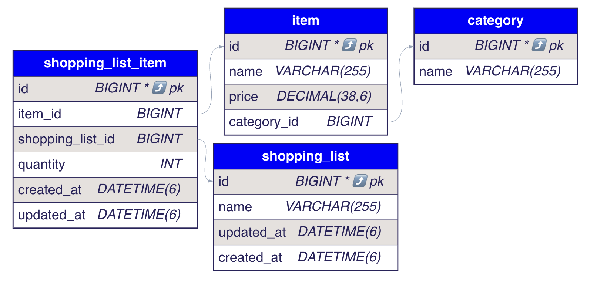

# Shopping List API

A simple Spring Boot REST API to manage shopping lists and their items.

## Tech Stack
- Java 17, Spring Boot 3
- Spring Web, Spring Data JPA
- H2 (in-memory, default)
- OpenAPI/Swagger UI

### Entity-Relationship Diagram


## Quick Start (Local)
```bash
./gradlew bootRun
```
Swagger UI: http://localhost:8080/swagger-ui/index.html  
H2 Console: http://localhost:8080/h2-console (JDBC URL: `jdbc:h2:mem:shoppingdb`)

## Run with Docker
```bash
docker build -t shopping-lists-api .
docker run -p 8080:8080 shopping-lists-api
```

## API Overview
Base path: `/api/shopping-lists`

- **Lists**
  - `POST /api/shopping-lists` – Create list (201)
  - `GET  /api/shopping-lists/{id}` – Get list by id (200)
  - `GET  /api/shopping-lists` – List all (200)
  - `PATCH /api/shopping-lists/{id}` – Update list fields (200)
  - `DELETE /api/shopping-lists/{id}` – Delete list (204)

- **List Items (subresource)**
  - `POST   /api/shopping-lists/{listId}/items` – Add existing item `{ itemId, quantity }` (200/201)
  - `GET    /api/shopping-lists/{listId}/items` – List items (200)
  - `PATCH  /api/shopping-lists/{listId}/items/{listItemId}` – Update quantity `{ quantity }` (200)
  - `DELETE /api/shopping-lists/{listId}/items/{listItemId}` – Remove line item (204)

- **Items catalog**
  - `GET /api/items` – List items (200)
  - `GET /api/items/{id}` – Get item (200)

## Example Requests
Create a list:
```bash
curl -X POST http://localhost:8080/api/shopping-lists \
  -H 'Content-Type: application/json' \
  -d '{"name":"My Groceries"}'
```
Add an item to a list:
```bash
curl -X POST http://localhost:8080/api/shopping-lists/1/items \
  -H 'Content-Type: application/json' \
  -d '{"itemId": 2, "quantity": 3}'
```
Update quantity:
```bash
curl -X PATCH http://localhost:8080/api/shopping-lists/1/items/5 \
  -H 'Content-Type: application/json' \
  -d '{"quantity": 4}'
```
Remove a line item:
```bash
curl -X DELETE http://localhost:8080/api/shopping-lists/1/items/5 -i
```

## Seeding Data
On startup the app loads `src/main/resources/data/initial.json` if repositories are empty.

## Build
```bash
./gradlew clean build    # runs tests
```

## Notes
- Errors are normalized by `GlobalExceptionHandler`.
- Duplicate list names return **409 Conflict**.